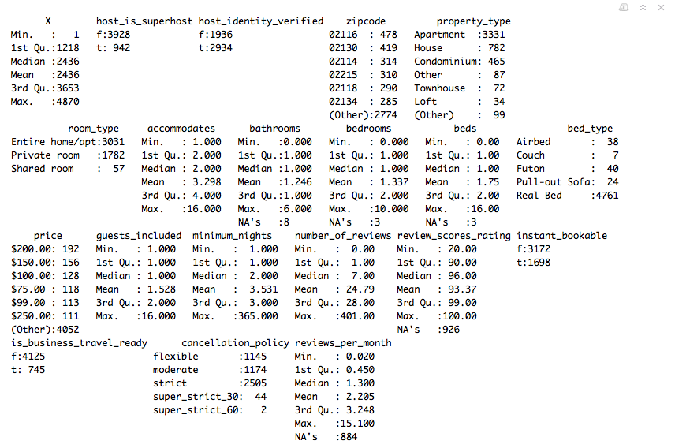

```{r setup, include=FALSE}
knitr::opts_chunk$set(echo = FALSE)

library(dummies)
```

```{r, include=FALSE}
# Import Data

# Choose whether to force reprocessing of data
reprocess = FALSE

if (file.exists("./data/boston_data.csv") && file.exists("./data/boston_data_undummied.csv") && !reprocess) {
  # Read in existing data from file
  boston <- read.csv("./data/boston_data.csv", sep = ",", header=TRUE, na.strings=c("", " ", "NA"))
  boston.data <- read.csv("./data/boston_data_undummied.csv", sep = ",", header=TRUE, na.strings=c("", " ", "NA"))
  
} else {
  # Read in full dataset
  full.data <- read.csv("./data/listings.csv", sep = ",", header=TRUE, na.strings=c("", " ", "NA"))
  
  # Select features to keep
  features_to_keep <- c("host_is_superhost", "host_identity_verified", "zipcode", "property_type", "room_type", "accommodates", "bathrooms", "bedrooms", "beds", "bed_type", "price", "guests_included", "minimum_nights", "number_of_reviews", "instant_bookable", "is_business_travel_ready", "cancellation_policy")
  boston.data.raw <- full.data[ , features_to_keep, drop=FALSE]
  
  # Omit NA values
  boston.data <- na.omit(boston.data.raw)
  
  # Correct feature datatypes
  
  # price
  boston.data$price <- as.numeric(gsub(",", "", substr(boston.data$price, 2, length(boston.data$price) - 1)))
  
  ## Remove categorical columns to be re-added
  categorical <- c("host_is_superhost", "host_identity_verified", "zipcode", "property_type", "room_type", "bed_type", "instant_bookable", "is_business_travel_ready", "cancellation_policy")
  boston <- boston.data %>% select(-one_of(categorical))
  
  ## host_is_superhost
  boston <- cbind(boston, host_is_superhost=dummy(boston.data$host_is_superhost, sep="_")[ , -1])
  
  ## host_identity_verified
  boston <- cbind(boston, host_identity_verified=dummy(boston.data$host_identity_verified, sep="_")[ , -1])
  
  ## instant_bookable
  boston <- cbind(boston, instant_bookable=dummy(boston.data$instant_bookable, sep="_")[ , -1])
  
  ## is_business_travel_ready
  boston <- cbind(boston, is_business_travel_ready=dummy(boston.data$is_business_travel_ready, sep="_")[ , -1])
  
  ## zipcode
  temp <- data.frame(dummy(boston.data$zipcode))[ , -1]
  boston <- cbind(boston, temp)
  
  ## property_type
  temp <- data.frame(dummy(boston.data$property_type))[ , -1]
  boston <- cbind(boston, temp)
  
  ## room_type
  temp <- data.frame(dummy(boston.data$room_type))[ , -1]
  boston <- cbind(boston, temp)
  
  ## bed_type
  temp <- data.frame(dummy(boston.data$bed_type))[ , -1]
  boston <- cbind(boston, temp)
  
  ## cancellation_policy
  temp <- data.frame(dummy(boston.data$cancellation_policy))[ , -1]
  boston <- cbind(boston, temp)
  
  # Save data
  write.csv(boston, file="./data/boston_data.csv")
  write.csv(boston.data, file="./data/boston_data_undummied.csv")
}
```


## Overview

Airbnb is a popular online company through which property owners can short-term rent their space to consumers as an alternative to hotels. Using data on Airbnb property listings in Boston, we will develop and test methods for determining the optimal price per night an owner should set for their property.


## Dataset: data source

The Inside Airbnb project by Murray Cox has collected public Airbnb listing data for 40+ popular international cities. We will use the Boston dataset containing ~5000 property listings and their features for the Boston area. (http://insideairbnb.com/get-the-data.html)


## Dataset: data features

- *host_is_superhost* (categorical) [yes/no]
- *host_identity_verified* (categorical) [yes/no]
- *zipcode* (categorical) [...]
- *property_type* (categorical) [House, Apartment, etc.]
- *room_type* (categorical) [Shared Room, Private Room, etc.]
- *accomodates* (continuous)
- *bathrooms* (continuous)
- *bedrooms* (continuous)
- *beds* (continuous)
- *bed_type* (categorical) [Real Bed, Futon, etc.]
- *guests_included* (continuous)
- *number_of_reviews* (continuous)
- *instant_bookable* (categorical) [Yes/No]
- *is_business_travel_ready* (categorical) [Yes/No]
- *minimum_nights* (continuous)
- *cancelation_policy* (ordered categorical) [Flexible, Moderate, Strict]
- **price** (continuous) 


## Dataset: initial data analysis
### One-variable summary statistics



## Dataset: initial data analysis (cont.)
### Two-variable summary statistics


## Dataset: initial data analysis (cont.)
### Missing values

There were 53 rows out of ~5000 with missing values, so we removed them.


## Methods

- We will perform and compare a variety of regression techniques, including linear regression and kernel methods. The comparison between the results of these methods is straightforward.

- We will also consider approaching the problem from a classification point of view, dividing the prices into ordered categorical ranges. Doing this will allow us to investigate the use of classification methods such as logistic regression and tree-based approaches.

- We will research/develop a means of comparing the results of the regression and classification methods.


